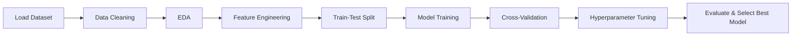

# Student Performance Prediction – Machine Learning Project

##  Overview
This project aims to **predict student final performance** (Pass / Fail) using **Supervised Machine Learning** techniques.  
Through structured data preprocessing, feature engineering, EDA, and model optimization, the goal is to convert raw student records into actionable insights that can help improve academic outcomes.

---

##  Business Objective
Educational institutions struggle to identify at-risk students early.  
Machine Learning can **flag students likely to underperform**, enabling:
- Early academic intervention
- Personalized learning support
- Data-driven decision-making

---

##  Project Workflow


---

##  Dataset Summary
- ~395 rows
- 33 columns (categorical & numerical)
- Contains features like:
  `school, age, study_time, failures, absences, health, G1, G2, G3, internet, romantic`

**Target Variable** → Student Outcome (`Pass = 1`, `Fail = 0`)

---

##  Data Preprocessing
✔ Handling missing values  
✔ Categorical encoding (One-Hot Encoding)  
✔ Feature scaling using **StandardScaler**  
✔ Added binary target using:
```python
df['target'] = np.where(df['G3'] >= 10, 1, 0)
```

---

##  Exploratory Data Analysis – Key Insights
- Higher study time → higher grades
- Students with more absences tend to have lower performance
- G1 & G2 are strong predictors of final G3 grade
- Dataset shows **slight imbalance** toward Pass class

---

##  Machine Learning Models Used
| Model | Notes |
|-------|-------|
| Logistic Regression | Baseline classifier |
| KNN | Good performance but sensitive to scaling |
| Decision Tree | Interpretability ✔ but overfits |
| Random Forest | Best balance of accuracy & generalization |
| Naive Bayes (Gaussian) | Efficient but weaker when features are correlated |

---

##  Model Evaluation Metrics
Metrics Used:
- Accuracy
- Precision
- Recall
- F1-Score
- ROC-AUC
- Confusion Matrix

Example Confusion Matrix:
```
TN = 18   FP = 4
FN = 6    TP = 46
```

---

##  Hyperparameter Tuning
Used **GridSearchCV + KFold(5)**  
Example:
```python
grid = GridSearchCV(pipe, param_grid=params, cv=kf, scoring='f1', n_jobs=-1)
grid.best_score_
```

> ⏳ Note: GridSearch took long due to large parameter grid — reduced search space was applied for optimization.

---

##  Final Best Model
**Random Forest Classifier**
- Best F1-Score on CV
- Strong generalization & handles feature noise

---

##  How to Run the Project Locally
```bash
# Clone repo
git clone https://github.com/<your-username>/Student-Performance-Prediction.git
cd Student-Performance-Prediction

# Install dependencies
pip install -r requirements.txt

# Run notebook
jupyter notebook "predicting student performance.ipynb"
```

---

## Project Structure
```
 Student-Performance-Prediction
│──  README.md
│──  requirements.txt
│──  predicting student performance.ipynb
│──  dataset
│──  plots
```

---

##  Next Improvements
🔹 Try SMOTE to handle class imbalance  
🔹 Deploy via Streamlit App  
🔹 Use feature selection or PCA to reduce dimensionality  
🔹 Try XGBoost / LightGBM  

---

##  Author
**Khaled Omar**  
 Open to collaboration, internship, ML-related roles  
 Connect with me on LinkedIn  

---
